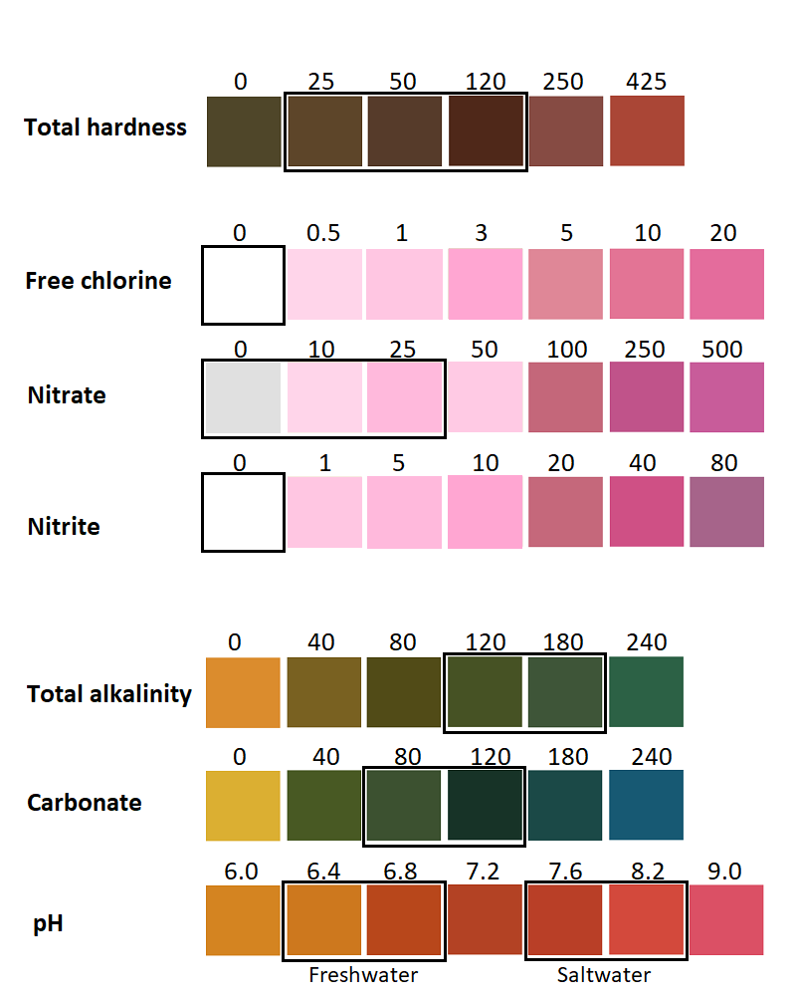

# 7-in-1 test strip

**Manufacturer**: [Milliard](https://www.milliardbrands.com/) 

* [Directions](#Directions)
* [Safe Values](#Safe-values)
* [Detailed breakdown](#Detailed-breakdown)

## Directions
1. Insert stick into your aquarium for 2 seconds
1. Remove and lay horizontal
1. Read measurements within 60 seconds

## Safe values

**Note:** Safe / favorable / ideal values depend on the species.

| Result             | Value                       |
|--------------------|-----------------------------|
| Hardness | Not too high or too low     |
| Free chlorine | Zero / Not present          |
| Nitrate (NO3) | < 50mg/L              |
| Nitrite (NO2) | < 1mg/L               |
| Alkalinity | 120 - 180 mg/L              |
| Carbonate | 80 - 120                    |
| pH | 6.5 - 8.5 (most freshwater) |

---

## Detailed breakdown

### Hardness

Total hardness refers to the amount of calcium and magnesium in the water. If water hardness level is significantly high, add soft water to your aquarium, for example distilled or osmosis water. If water hardness is too low, perform a partial water change with tap water of a higher hardness.

### Free chlorine

Chlorine may be present in tap water. It is harmful to fish, damagining their gills and skin, and should not be present in fish tank water.

### Nitrate & nitrite

As part of the nitrogen cycle in your aquarium, organic material that contains nitrogen, such as fish waste or uneaten food, along with dissolved waste excreted directly by the fish, degrades to produce nitrite (NO-2). Finally, nitrate (NO-3) occurs and may accumulate.

High nitrite levels for extended periods is harmful to your fish and can lead to the loss of oyur fish over time. High nitrate levels is harmful to sensitive or young fish and additionally promotes algae growth. If nitrite or nitrate concentrations are too high, we recommend proceeding with a partial water change.

### Alkalinity

Total alkalinity measures the amount of alkaline substances (primarily bicarbonates and carbonates) in your water.

### Carbonate

Carbonate stabilizes the pH value of your water. It helps neutralize the acids in your fish tank, preventing unsafe swings in pH that can make water toxic to your fish. When carbonate levels rise, so does pH.

### pH

pH refers to the intensity of acid or alkaline materials in your water.
